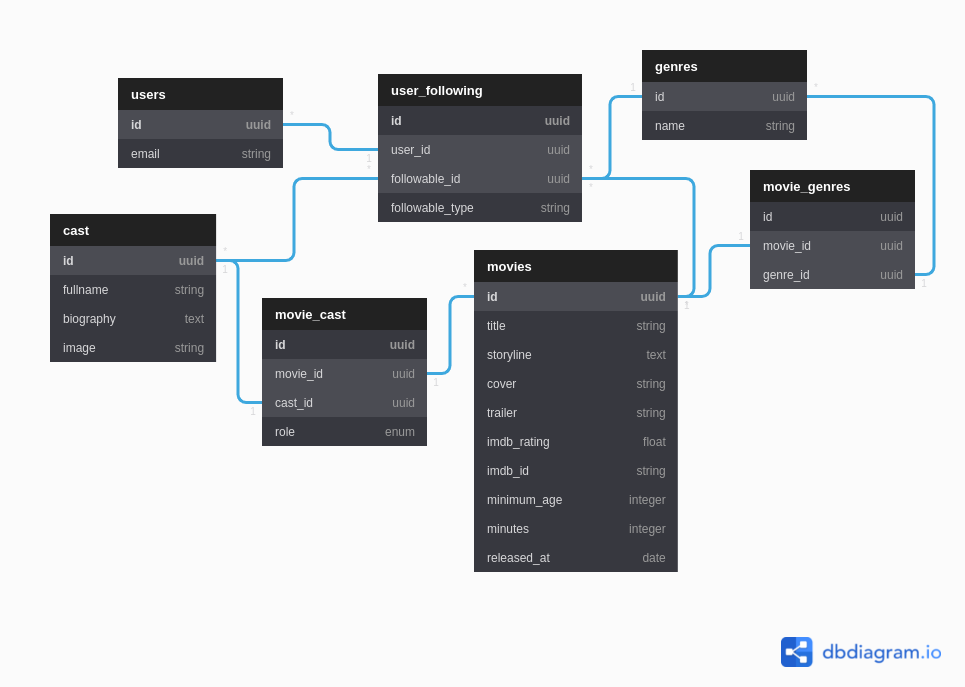

[](https://www.codacy.com/gh/nejdetkadir/rories-api/dashboard?utm_source=github.com&amp;utm_medium=referral&amp;utm_content=nejdetkadir/rories-api&amp;utm_campaign=Badge_Grade)

# RORIES API
Movies API with Ruby on Rails API


# Features
- User can sign up / log in / change the password
- User can follow movies / genres / cast(star/director/writer)
- The system should suggest movies based on our follows
- Writed unit test with rspec
- Authentication periods are created with devise and devise-jwt 

# Installation
## Prerequisites
- [Ruby](https://rvm.io/)
- [NodeJS (>=10.x)](https://nodejs.org/en/download/package-manager/#debian-and-ubuntu-based-linux-distributions)
- [PostgreSQL](https://www.postgresql.org/download/)
- [ImageMagick](https://imagemagick.org/) `sudo apt-get install imagemagick libmagickcore-dev libmagickwand-dev`

## For development
### API endpoints for V1
#### Authentication
| Route | HTTP Verb | Request Body | Header Body | Description |
| --- | --- | --- | --- | --- |
| /api/v1/users | `POST` | ```{user: {email: "foo@bar.com", password: "mypass", password_confirmation: "mypass"}}``` | Empty | Returns authentication bearer token on header |
| /api/v1/users/sign_in | `POST` | ```{user: {email: "foo@bar.com", password: "mypass"}}``` | Empty | Returns authentication bearer token on header |
| /api/v1/users/sign_out | `DELETE` | Empty  | Authentication: Bearer Token | Returns sign out message |
| /api/v1/users/password | `POST` | ```{user: {email: "foo@bar.com"}}```  | Empty | Returns instructions about resetting password  |
| /api/v1/users/password | `PATCH` | ```{user: {reset_password_token: "token", password: "securepass", password_confirmation: "securepass"}}```  | Empty | Returns status |

#### Feed
| Route | HTTP Verb | Request Body | Header Body | Description |
| --- | --- | --- | --- | --- |
| /api/v1/feed | `GET` | Empty | Authentication: Bearer Token | Returns suggested movies based on user's follows (limit 25) |
| /api/v1/feed?page=:page | `GET` | Empty | Authentication: Bearer Token | Returns next suggested movies based on user's follows (limit 25) |


#### Genres
| Route | HTTP Verb | Request Body | Header Body | Description |
| --- | --- | --- | --- | --- |
| /api/v1/genres | `GET` | Empty | Empty | Returns genres |
| /api/v1/genres/:id | `GET` | Empty | Empty | Returns resource with by id |
| /api/v1/genres/:id/follow| `POST` | Empty | Authentication: Bearer Token | Returns id of resource or errors |
| /api/v1/genres/:id/unfollow| `DELETE` | Empty | Authentication: Bearer Token | Returns status |

#### Movies
| Route | HTTP Verb | Request Body | Header Body | Description |
| --- | --- | --- | --- | --- |
| /api/v1/movies | `GET` | Empty | Authentication: Bearer Token (if user signed in) | Returns movies (limit 25) |
| /api/v1/movies?page=:page | `GET` | Empty | Authentication: Bearer Token (if user signed in) | Returns next movies (limit 25) |
| /api/v1/movies/:id| `GET` | Empty | Authentication: Bearer Token (if user signed in) | Returns resource with by id |
| /api/v1/movies/:id/follow| `POST` | Empty | Authentication: Bearer Token | Returns id of resource or errors |
| /api/v1/movies/:id/unfollow| `DELETE` | Empty | Authentication: Bearer Token | Returns status |

#### Cast
| Route | HTTP Verb | Request Body | Header Body | Description |
| --- | --- | --- | --- | --- |
| /api/v1/cast/:id| `GET` | Empty | Authentication: Bearer Token (if user signed in) | Returns resource with by id |
| /api/v1/cast/:id/follow| `POST` | Empty | Authentication: Bearer Token | Returns id of resource or errors |
| /api/v1/cast/:id/unfollow| `DELETE` | Empty | Authentication: Bearer Token | Returns status |

### Environment variables
Create a file named ".env" in the root directory and fill its contents as follows.
```ruby
DEVISE_JWT_SECRET_KEY=X
GMAIL_USERNAME=X
GMAIL_PASSWORD=X
RESET_PASSWORD_URL=X
```

## For Running
- Install GEM dependencies:

  ```bash
  bundle install
  ```

- Create database, migrate tables and run the seed data:

  ```bash
  rails db:create
  rails db:migrate
  rails db:seed
  ```

- If you are setting up again, when you already have previous databases:

  ```bash
  rails db:reset
  ```
- For dropping database
  ```bash
  rails db:drop
  ``` 

# LICENSE
```
GNU GENERAL PUBLIC LICENSE Version 3
```
